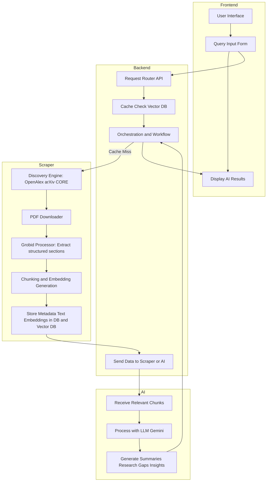

# Research Genie Architecture

## Microservices Overview

| Microservice | Role |
| ------------- | ---- |
| **Frontend** | Provides user interface for submitting queries and displaying AI-generated insights. |
| **Backend** | Acts as the central orchestrator — manages workflow, caching, communication between services, and database interactions. |
| **Scraper** | Fetches research papers from APIs/websites, processes PDFs using Grobid, extracts structured text, generates embeddings, and stores data in databases. |
| **AI / RAG** | Uses LLM (e.g., Gemini) to analyze retrieved content and generate summaries, research gaps, and insights. |

---

## Data Stores

| Store | Purpose |
| ------ | -------- |
| **Database (PostgreSQL / MongoDB)** | Stores metadata, structured text chunks, and processed outputs. |
| **Vector DB (Pinecone / FAISS / Weaviate)** | Stores embeddings of text chunks for semantic search and retrieval. |
| **Storage (S3 / Local)** | Stores original PDFs and other raw files for future processing. |

---

## Architecture Flow

---

## Notes

1.  **Backend Orchestration:** Controls data flow between all microservices.
2.  **Scraper Preprocessing:** Handles downloading, text extraction, and embedding generation.
3.  **Vector DB Caching:** Reduces redundant work and improves response time.
4.  **AI Integration:** Works on retrieved or newly processed data to create responses.
5.  **Asynchronous Execution:** Scraping and embedding tasks can run in background workers for scalability.
6.  **Modular Design:** Each microservice (Scraper, Backend, AI) is independent and scalable.